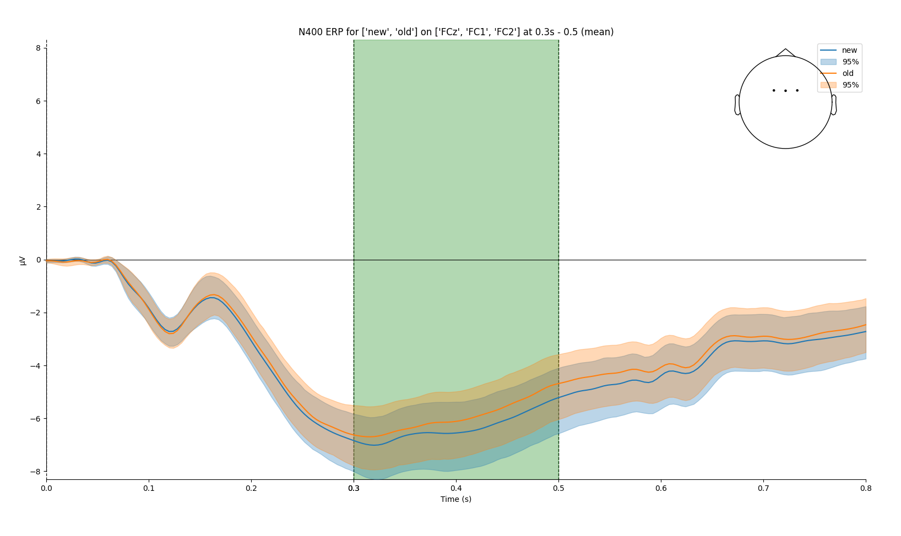
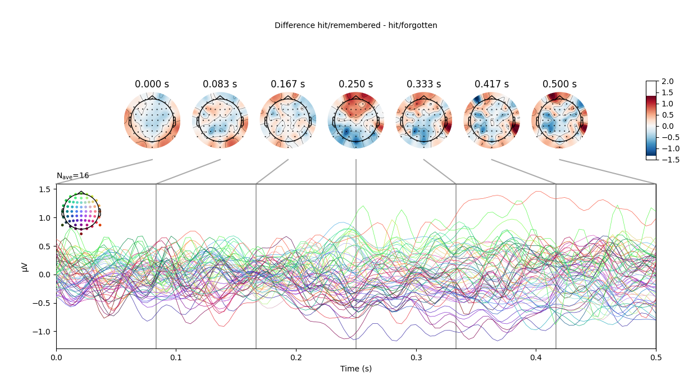

# EEGManyPipelines

Description and analysis plan for the EEGManyPipelines project

## 1. Preprocessing

### 1.0 manual data inspection

 detect bad channels by `RANSAC`, interpolate bads. note down how many channels were interpolated per participant.

### 1.1 re-referencing

Re-referencing to average electrode (reasoning: to approximat electrode reference that is most generalizable to all electrodes)

### 1.2 filtering

1. Band: 0.1-100 Hz (FIR). Before/after epoching is not relevant, as jitter is only +-4ms
2. downsampling to 250 Hz (as for ERP no relevant frequencies are higher than that, and it's questionable if higher frequencies can even be measured reliably in EEG)
3. For ERPs: 35 LP + Notch 50 Hz
4. For Open questions: leave original LP

### 1.3 Artefact rejection

#### 1.3.1 Eye blinks & horizontal eye movements

1. ICA, find Eyeblink components from 64 components
2. blinks will be easy to detect
3. horizontal eye movements will be more difficult
4. check manually!
5. Only apply ICA correction to time spans where eye blinks / heog are actually observed
6. Apply to all channels
7. Are eyeblinks corrected? Visual random sample check

#### 1.3.2 artefact rejection

2. Epoch data based on trial trigger -200 to 500 ms

3. Apply artefact criteria per trial
   
   - same as [Bublatzky et al 2020]([https://doi.org/10.1016/j.cortex.2020.07.009](https://doi.org/10.1016/j.cortex.2020.07.009 "Persistent link using digital object identifier")) 
   - maximal allowed voltage step of 50 mV/ms;
   - maximal allowed difference of values in 200 msec intervals of 200 mV; 
   - minimal/maximal allowed amplitude of ± 100 mV

4. good/bad trials measurement, percentage bad per participant

5. calculate good/bad channels percentage per trial type / hypothesis interest

## 2. Analysis

Data at this point:

- `epochs_freq`
  - from -200ms to +500ms after trigger onset
  - baseline corrected from -200ms to 0ms
  - bad epochs marked by `autoreject`
  - Original sampling frequency of 512
- `epochs_erp`
  - same as above 
  - additional LP 35 Hz
  - downsampled to 250 Hz

### 2.1 H1: Effect of scene category

```
There is an effect of scene category (i.e., a difference between images showing
man-made vs. natural environments) on the amplitude of the N1 component, i.e. the
first major negative EEG voltage deflection.
```

Using `epochs_erp`

- Don't use peak amplitude, because not reliable, as peak cannot always be determined accurately

**Find best electrode to detect the N1**

1. make avg of trials per subj per electrode
2. Find first negative peak 50-120ms, see which electrode has lowest amplitude
3. use this electrode for further calculations

**calculate component**

1. calculate voltage per participant for chosen electrode
2. time windows for component min to max of peak +-5ms 
3. AUC +-5ms of peak, take one time window for all participants
4. repeated measures ttest

**Results:**

- Negative peak between `0.08` and `0.15` on grand average is at `125ms @ Fz`.
- voltage +-5ms:
  - `man-made = -3.05+-1.81 uV`
  - `natural  = -2.71+-1.82 uV`
- repeated measures ttest (`ttest_rel`)
  - `p = 0.00093` 
- Cluster analysis showed significant cluster on occipital electrodes at a later point


 

### 2.2 H2: image novelty

```
There are effects of image novelty (i.e., between images shown for the first time/new
vs. repeated/old images) within the time-range from 300–500 ms ...
   a. ... on EEG voltage at fronto-central channels.
   b. ... on theta power at fronto-central channels.
   c. ... on alpha power at posterior channels.
```

Using `epochs_erp`

**H2a Calculate**

1. make avg of trials per subj per electrode
2. plot grand averages from 300-500ms, take peak negative electrode and surrounding frontal electrodes
3. AUC 300ms-500ms of peak
   * repeated measures ttest

**Results**

* Negative peak between `0.3` and `0.5` on grand average is at `FCz`
* Taking electrodes `['FCz', 'FC1', 'FC2', 'Fz', 'F2', 'F1']`
* voltage from `300-500ms` on these electrodes: 
  * `new = -6.39+-3.46 uV`
  * `old = -6.00+-3.53 uV`
* repeated measures ttest (`ttest_rel`)
  * `p = 0.0000046`





**H2b Calculate**

1. calculate spectra for theta (4-7 Hz)  for the time range using Wavelet

    **methods**:

```raw
For each participant:
    For each epoch of participant:
        1. calculate wavelet with
        - freq = array([4. , 4.5 , 5. , 5.5, 6., 6.5, 7.0 ])
        - use half cycles
    2. take segment between 300-500ms for fronto-central electrodes
    3. calculate mean over result
```

**Result**

- For electrodes `[FCz, FC1, FC2]`
- Mean Power between 300-500 ms
  - `new 7.04e-10+-2.62e-10`
  - `old 7.26e-10+-2.56e-10`
  - `p = 0.00074`

**Problems**:

- How to normalize histograms?
- What to do with outliers?


**H2C**

    **methods**:

```raw
For each participant:
    For each epoch of participant:
        1. calculate wavelet with
        - freq = array([8. ,  8.5,  9. ,  9.5, 10. , 10.5, 11. , 11.5, 12. , 12.5, 13. , 13.5,])
        - use half cycles
    2. take segment between 300-500ms for posterior electrodes
    3. calculate mean over result
```

**Result**

* For electrodes `['P1', 'P3', 'P5', 'P7', 'P9', 'PO7', 'PO3', 'POz', 'Pz', 'P2', 'P4', 'P6', 'P8', 'P10', 'PO8', 'PO4']`
* Mean Power between 300-500 ms
  * `new 4.55e-10+-2.12e-10`
  * `old 4.56e-10+-2.16e-10`
  * `p = 0.6`


### 2.3 H3: successful recognition

```
There are effects of successful recognition of old images (i.e., a difference between
old images correctly recognized as old [hits] vs. old images incorrectly judged as new
[misses]) ...
   a. ... on EEG voltage at any channels, at any time.
   b. ... on spectral power, at any frequencies, at any channels, at any time.
```

- plot grand avrg and differences between categories
- for later: divide in time windows, calculate statistics, use cluster analysis / stats corrections to check where differences are significant
- mass univat ansatz
- cluster correction from oostenfeld


### 2.3 H4: successful recognition

```
4. There are effects of subsequent memory (i.e., a difference between images that will
be successfully remembered vs. forgotten on a subsequent repetition) ...    
  a. ... on EEG voltage at any channels, at any time.
  b. ... on spectral power, at any frequencies, at any channels, at any time.
```

same as above




## notes/questions:

### 28.02

1) Should timepoint/electrode be decided on ALL epochs or only on epochs relevant for the current H1?

2) `man-made` contains all different kind of conditions for H1, combine?

```Python
 'man-made/new/correct-rejection/N/A': 158
 'man-made/new/correct-rejection/forgotten': 94
 'man-made/new/correct-rejection/remembered': 24
 'man-made/new/false-alarm/N/A': 15
 'man-made/new/false-alarm/forgotten': 18
 'man-made/new/false-alarm/remembered': 5
 'man-made/old/hit/N/A': 131
 'man-made/old/hit/forgotten': 102
 'man-made/old/hit/remembered': 6
 'man-made/old/miss/N/A': 10
 'man-made/old/miss/forgotten': 25
 'man-made/old/miss/remembered': 3
```

3. spectogram: averaging before spectogram creation or after?
4. Equalize event counts before averaging?
5. Resampling later?

make difference topo plot

### earlier

EMP20 weird oscillations
EMP21 noisy